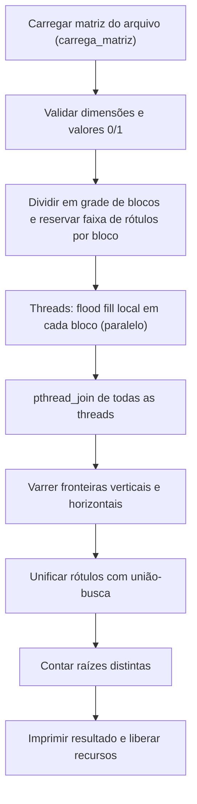
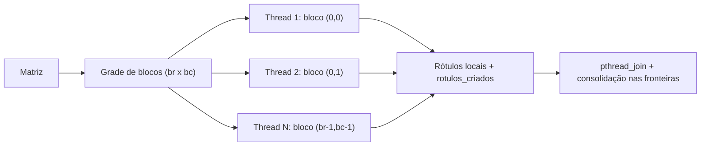
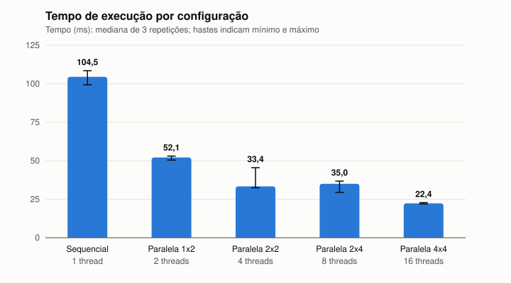
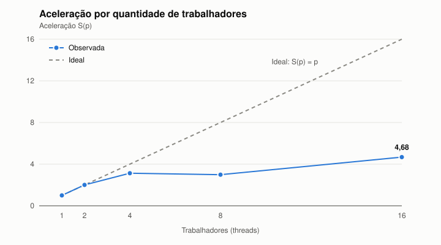
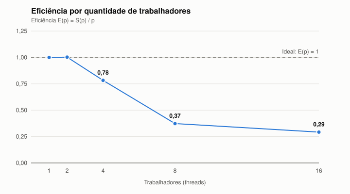

# Relatório técnico - Contagem paralela de objetos em uma matriz binária

> **Disciplina:** Sistemas Operacionais - 2026/II  
> **Professor:** Prof. Filipo Novo Mór  
> **Instituição:** Pontifícia Universidade Católica do Rio Grande do Sul - Escola Politécnica  
> **Repositório:** [https://github.com/rafaelavarao/T1_SISOP](https://github.com/rafaelavarao/T1_SISOP)  
> **Versão do relatório:** 1.0  
> **Data:** 29/09/2026

## Identificação

| Campo | Informação |
|---|---|
| Integrante 1 | Rafaela Varão |
| Matrícula do integrante 1 | 212009427 |
| Integrante 2 | Gabriel Gauterio |
| Matrícula do integrante 2 | 21102126 |
| Integrante 3 | Gabriel Dalbem |
| Matrícula do integrante 3 | 22106291 |
| Modalidade | Trio |
| Turma | Turma 330 |
| Estratégia paralela | Pthreads |
| Plataforma testada | Linux |
| Commit avaliado | `32df92c`|

## Resumo

Este trabalho conta objetos em uma matriz binária, definidos como componentes de células `1` conectadas com conectividade 8. A versão sequencial percorre a matriz em ordem de leitura e, a cada célula `1` ainda não rotulada, executa um *flood fill* iterativo com pilha explícita, que rotula todo o componente e incrementa o contador. A versão paralela divide a matriz em uma grade configurável de blocos retangulares, com uma thread POSIX por bloco; cada thread rotula os componentes locais do seu bloco escrevendo apenas em sua fatia exclusiva da matriz de rótulos e usando uma faixa de identificadores reservada, sem necessidade de exclusão mútua. Após o `pthread_join`, uma etapa sequencial percorre as fronteiras verticais e horizontais entre blocos e unifica, com união-busca, os rótulos de células vizinhas (inclusive diagonais), contando ao final as raízes distintas. As duas versões produziram os resultados esperados nas cinco matrizes obrigatórias e 122710 objetos em uma matriz 2000 x 2000. Nessa matriz, a versão paralela obteve aceleração de 3,13 com 4 threads e 4,68 com 16 threads, mostrando ganho real, mas limitado pelo número de núcleos disponíveis.

**Palavras-chave:** sistemas operacionais; paralelismo; processos; threads; conectividade 8; flood fill; componentes conexos.

## 1. Visão geral do problema

O programa recebe uma matriz binária na qual `0` representa o fundo e `1` representa o primeiro plano. Um objeto corresponde a um componente de células de valor `1` conectadas horizontalmente, verticalmente ou diagonalmente, conforme a **conectividade 8**.

O projeto contém duas implementações funcionalmente equivalentes:

1. uma versão sequencial, usada como referência de correção e de desempenho;
2. uma versão paralela baseada em Pthreads (POSIX threads).

### 1.1 Objetivos da implementação

- Contar corretamente os objetos com conectividade 8.
- Distribuir trabalho efetivo entre pelo menos duas unidades de execução.
- Reconhecer e unificar objetos que atravessam as divisões da matriz.
- Produzir resultados determinísticos e idênticos nas versões sequencial e paralela.
- Evitar condições de corrida, deadlocks, atualizações perdidas e contagens duplicadas.
- Avaliar correção, sobrecarga, escalabilidade, aceleração e eficiência.

### 1.2 Requisitos atendidos

| Requisito | Como foi atendido | Evidência no repositório |
|---|---|---|
| ANSI C C89/C90 | Todo o código é compilado com `-std=c89 -Wall -Wextra -pedantic`, sem erros nem avisos. | [`Makefile`](Makefile), [`src/`](src/) |
| Conectividade 8 | Vetores de deslocamento `dr`/`dc` com os 8 vizinhos em ambos os *flood fills*. | [`conta-objetos-sequencial.c`](src/conta-objetos-sequencial.c) (`inunda`, linhas 27-61); [`conta-objetos-paralelo.c`](src/conta-objetos-paralelo.c) (`inunda_bloco`, linhas 48-84) |
| Versão sequencial | *Flood fill* iterativo com pilha explícita a partir de cada `1` não rotulado. | [`src/conta-objetos-sequencial.c`](src/conta-objetos-sequencial.c) |
| Versão paralela | Grade de blocos, uma thread Pthread por bloco, consolidação por união-busca. | [`src/conta-objetos-paralelo.c`](src/conta-objetos-paralelo.c) |
| Duas ou mais unidades concorrentes | Com grade `2 x 2` são criadas 4 threads; um aviso é emitido se houver menos de 2 blocos. | `./conta-objetos-paralelo tests/exemplo3.txt 2 2`; linhas 198-202 e 286-300 |
| Quantidade configurável de trabalhadores | Argumentos `<blocos_linha> <blocos_coluna>` na linha de comando (threads = produto). | `main`, linhas 174-196 |
| Consolidação entre regiões | União-busca (compressão de caminho e união por tamanho) sobre os rótulos das fronteiras. | `encontra`/`uniao` (linhas 121-146); fronteiras (linhas 318-358) |
| Tratamento horizontal, vertical e diagonal | Janela de ±1 linha nas fronteiras verticais e ±1 coluna nas horizontais. | Linhas 318-358; Exemplo 3 (encontro de 4 blocos) correto com grade `2 x 2` |
| Verificação das chamadas POSIX | Retornos de `pthread_create`, `pthread_join` e `clock_gettime` verificados. | Linhas 282-300 e 360-362 |
| Liberação dos recursos | Todas as threads recebem `pthread_join`; toda memória é liberada com `free`/`libera_matriz`. | Linhas 392-400; Valgrind: "All heap blocks were freed" (seção 10.2) |
| Compilação reproduzível | `make`, `make clean` e `make test`. | [`Makefile`](Makefile) |

## 2. Organização do repositório

```text
.
├── README.md
├── Makefile
├── .gitignore
├── Trabalho_Pratico_Processos_Threads_Contagem_Objetos.pdf
├── src/
│   ├── conta-objetos-sequencial.c
│   ├── conta-objetos-paralelo.c
│   ├── gera-matriz.c
│   ├── matriz_io.c
│   └── matriz_io.h
├── tests/
│   ├── exemplo1.txt
│   ├── exemplo2.txt
│   ├── exemplo3.txt
│   ├── exemplo4.txt
│   ├── exemplo5.txt
│   ├── adicional1-zeros.txt
│   ├── adicional2-objeto-unico.txt
│   ├── adicional3-diagonais.txt
│   └── adicional4-celulas-isoladas.txt
├── results/
│   ├── medicoes.csv
│   ├── gera-graficos.py
│   ├── grafico-tempo.svg
│   ├── grafico-aceleracao.svg
│   └── grafico-eficiencia.svg
└── slides/
    └── Contagem paralela de objetos - T1 SISOP.pptx
```

| Caminho | Finalidade |
|---|---|
| `README.md` | Este relatório técnico. |
| `Makefile` | Compilação dos três executáveis e execução dos testes obrigatórios (`make test`). |
| `Trabalho_Pratico_Processos_Threads_Contagem_Objetos.pdf` | Enunciado do trabalho. |
| `src/conta-objetos-sequencial.c` | Implementação sequencial de referência. |
| `src/conta-objetos-paralelo.c` | Implementação paralela com Pthreads. |
| `src/gera-matriz.c` | Gerador de matrizes aleatórias (com semente fixa) para os testes de desempenho. |
| `src/matriz_io.c`, `src/matriz_io.h` | Alocação contígua, leitura/validação e geração de matrizes, compartilhadas pelos programas. |
| `tests/exemplo1.txt` a `tests/exemplo5.txt` | Cinco matrizes obrigatórias do enunciado. |
| `tests/adicional1-zeros.txt` a `tests/adicional4-celulas-isoladas.txt` | Matrizes dos casos de teste adicionais (seção 8.3). |
| `results/medicoes.csv` | Dados brutos das medições de desempenho (seção 9.4). |
| `results/gera-graficos.py` | Script (Python 3, só biblioteca padrão) que gera os gráficos a partir de `medicoes.csv`. |
| `results/grafico-*.svg` | Gráficos de tempo, aceleração e eficiência (seções 9.5 a 9.7). |
| `slides/` | Slides da apresentação. |

A matriz de desempenho (`tests/desempenho.txt`, 2000 x 2000) não é versionada por causa do tamanho (está no `.gitignore`); ela é regenerada de forma determinística com o comando da seção 9.1.

## 3. Ambiente de desenvolvimento e execução

### 3.1 Hardware e software

| Item | Especificação |
|---|---|
| Equipamento | Notebook HP 200 G2i 16" |
| Processador | Intel Core 5 120U (1,40 GHz) |
| Núcleos físicos | 10 (2 de desempenho + 8 de eficiência) |
| Processadores lógicos | 12 |
| Memória RAM | 16 GB (7,6 GB disponíveis para o WSL 2) |
| Sistema operacional | Ubuntu 26.04.1 LTS no WSL 2 (kernel 6.18.40.1-microsoft-standard-WSL2), sobre Windows 11 Home |
| Arquitetura | x86_64 |
| Compilador | `cc (Ubuntu 15.2.0-16ubuntu1) 15.2.0` (GCC 15.2.0) |
| Padrão da linguagem | C89/C90 |
| APIs POSIX utilizadas | Pthreads (`pthread_create`, `pthread_join`), `clock_gettime(CLOCK_MONOTONIC)` |
| Flags de compilação | `-std=c89 -Wall -Wextra -pedantic` (paralela: `-pthread`) |

### 3.2 Compilação

Requer um compilador C com suporte a Pthreads (Linux ou macOS). Em Windows, use o WSL (Ubuntu): `sudo apt install build-essential` e depois os comandos abaixo dentro do WSL.

```bash
make clean
make
```

Comandos equivalentes sem `make`:

```bash
cc -std=c89 -Wall -Wextra -pedantic src/conta-objetos-sequencial.c src/matriz_io.c -o conta-objetos-sequencial
cc -std=c89 -Wall -Wextra -pedantic -pthread src/conta-objetos-paralelo.c src/matriz_io.c -o conta-objetos-paralelo
cc -std=c89 -Wall -Wextra -pedantic src/gera-matriz.c src/matriz_io.c -o gera-matriz
```

### 3.3 Execução

```bash
./conta-objetos-sequencial <arquivo_matriz>
./conta-objetos-paralelo <arquivo_matriz> <blocos_linha> <blocos_coluna>
./gera-matriz <linhas> <colunas> <probabilidade_de_1> <semente> <arquivo_saida>
```

Na versão paralela, o número de threads é `blocos_linha x blocos_coluna` (uma thread por bloco).

**Exemplo reproduzível:**

```bash
make
./conta-objetos-sequencial tests/exemplo3.txt
./conta-objetos-paralelo tests/exemplo3.txt 2 2
make test   # executa as 5 matrizes obrigatórias nas duas versões (paralela com grade 2x2)
```

**Teste de desempenho (matriz 2000 x 2000):**

A matriz grande não está no repositório (ver seção 2), então é preciso gerá-la uma vez antes de rodar. Com a semente fixa `42`, o arquivo gerado é sempre o mesmo (cerca de 8 MB).

```bash
make
./gera-matriz 2000 2000 0.35 42 tests/desempenho.txt   # 2000 x 2000, 35% de 1s, semente 42
./conta-objetos-sequencial tests/desempenho.txt        # referência
./conta-objetos-paralelo tests/desempenho.txt 2 2      # 4 threads
./conta-objetos-paralelo tests/desempenho.txt 4 4      # 16 threads
```

As três execuções devem imprimir `Objetos: 122710`; o que muda é o `Tempo (s)`, usado nas medições da seção 9. Saída esperada da versão paralela com grade `2 x 2`:

```text
Dimensoes: 2000 x 2000
Blocos: 2 x 2 (4 threads)
Objetos: 122710
Tempo (s): <tempo medido>
```

No WSL, o repositório clonado no Windows fica acessível em `/mnt/c/...` (por exemplo, `cd "/mnt/c/Users/<usuario>/<pasta>/T1_SISOP"`); os comandos acima devem ser executados a partir da raiz do repositório.

### 3.4 Formato da entrada e da saída

A matriz é fornecida em um arquivo texto: a primeira linha contém `<linhas> <colunas>` e as linhas seguintes contêm os valores `0`/`1` separados por espaço. A leitura (`carrega_matriz`, em `src/matriz_io.c`) valida o cabeçalho, exige dimensões mínimas de 3 x 3, verifica se há valores suficientes e rejeita valores diferentes de 0 e 1. O número de trabalhadores é configurado pelos dois últimos argumentos da versão paralela; valores maiores que as dimensões da matriz são limitados ao número de linhas/colunas.

Entrada (`tests/exemplo3.txt`):

```text
8 8
1 1 0 0 0 0 0 0
1 0 0 0 0 0 0 0
0 0 0 0 0 0 1 0
0 0 0 1 1 0 1 0
0 0 0 1 1 0 0 0
0 0 0 0 0 0 0 0
0 0 1 0 0 0 0 1
0 0 1 0 0 0 1 1
```

Saída da versão paralela (o tempo varia a cada execução):

```text
Dimensoes: 8 x 8
Blocos: 2 x 2 (4 threads)
Objetos: 5
Tempo (s): <tempo medido>
```

A versão sequencial imprime `Dimensoes`, `Objetos` e `Tempo (s)`.

## 4. Arquitetura da solução

### 4.1 Fluxo geral



### 4.2 Estruturas de dados principais

| Estrutura | Tipo/representação | Responsabilidade | Compartilhada? | Proteção utilizada |
|---|---|---|---|---|
| Matriz de entrada | `int **` com dados em um único bloco contíguo (`aloca_matriz`) | Armazenar `0` e `1` | Sim | Somente leitura durante a fase paralela |
| Matriz de rótulos | `int **` contígua, inicializada com 0 | Marcar células visitadas e seu rótulo local | Sim | Cada thread escreve apenas nas células do seu bloco (regiões disjuntas) |
| Pilha do flood fill | Vetor de `Ponto` com capacidade igual à área do bloco | Percorrer um componente sem recursão | Não (uma por thread) | Não se aplica |
| Tarefas/regiões | Vetor `ArgBloco` (limites do bloco, `rotulo_base`, `rotulos_criados`) | Descrever o trabalho de cada thread | Não (cada thread recebe o seu elemento) | Não se aplica |
| Equivalências de rótulos | Vetores `pai` e `tamanho` (união-busca) | Consolidar componentes | Não (usados só após o `join`) | Não se aplica |
| Resultados locais | Campo `rotulos_criados` de cada `ArgBloco` | Quantidade de componentes locais | Escrito pela thread, lido pela principal | Leitura só após `pthread_join` |

## 5. Implementação sequencial

### 5.1 Algoritmo

A função `conta_objetos` percorre a matriz linha a linha. Ao encontrar uma célula com valor `1` e rótulo `0` (ainda não visitada), incrementa o contador e chama `inunda`, que empilha a célula inicial, marca-a com o rótulo atual e, enquanto a pilha não estiver vazia, desempilha uma célula e examina seus oito vizinhos, definidos pelos vetores `dr = {-1,-1,-1,0,0,1,1,1}` e `dc = {-1,0,1,-1,1,-1,0,1}`. Cada vizinho dentro dos limites da matriz, com valor `1` e ainda não rotulado, é rotulado e empilhado. Como a célula é rotulada no momento em que é empilhada, nenhuma célula entra na pilha duas vezes. Ao final, o contador é o número de objetos.

### 5.2 Pseudocódigo

```text
FUNÇÃO contar_objetos_sequencial(matriz):
    rotulo[*][*] <- 0
    pilha <- vetor com capacidade linhas * colunas
    contador <- 0
    PARA i DE 0 ATÉ linhas-1:
        PARA j DE 0 ATÉ colunas-1:
            SE matriz[i][j] = 1 E rotulo[i][j] = 0:
                contador <- contador + 1
                rotulo[i][j] <- contador; empilha (i, j)
                ENQUANTO pilha não vazia:
                    (r, c) <- desempilha
                    PARA cada (dr, dc) dos 8 vizinhos:
                        (nr, nc) <- (r + dr, c + dc)
                        SE (nr, nc) dentro da matriz E matriz[nr][nc] = 1 E rotulo[nr][nc] = 0:
                            rotulo[nr][nc] <- contador; empilha (nr, nc)
    RETORNA contador
```

### 5.3 Complexidade e uso de memória

| Aspecto | Análise | Justificativa |
|---|---|---|
| Complexidade de tempo | O(L x C) | Cada célula é visitada uma vez na varredura e empilhada no máximo uma vez; cada desempilhamento examina 8 vizinhos (constante). |
| Complexidade de espaço | O(L x C) | Matriz de entrada, matriz de rótulos e pilha com capacidade para todas as células. |
| Risco de recursão excessiva | Não existe | O *flood fill* é iterativo com pilha explícita alocada no heap, evitando estouro da pilha de chamadas em objetos grandes. |

## 6. Implementação paralela

### 6.1 Modelo de concorrência

| Decisão | Escolha do grupo | Justificativa |
|---|---|---|
| Unidade de execução | Thread (Pthreads) | As threads compartilham o espaço de endereçamento, então a matriz e os rótulos são acessados diretamente, sem cópia nem IPC. |
| Quantidade de trabalhadores | `blocos_linha x blocos_coluna`, informados na linha de comando | Permite reproduzir as divisões do enunciado (2x2, 3x3) e também faixas de linhas (`N x 1`) ou colunas (`1 x N`). |
| Divisão do trabalho | Blocos retangulares em grade | Cada bloco é independente durante a rotulação local; a consolidação depende apenas do perímetro dos blocos. |
| Escalonamento | Estático (um bloco por thread) | Blocos de tamanho equilibrado e custo proporcional à área; dispensa fila e sincronização. |
| Comunicação | Memória compartilhada (matriz, rótulos e vetor `ArgBloco`) | Cada thread lê a matriz e escreve em regiões disjuntas; os resultados são lidos pela thread principal após o `join`. |
| Sincronização | Apenas `pthread_join` | Não há região crítica na fase paralela; o `join` garante que todas as escritas das threads estejam visíveis antes da consolidação. |

### 6.2 Decomposição da matriz

As linhas são divididas em `blocos_linha` faixas e as colunas em `blocos_coluna` faixas (linhas 238-259). Cada faixa recebe `linhas / blocos_linha` linhas (ou `colunas / blocos_coluna` colunas) e as primeiras `resto` faixas recebem uma unidade extra, de modo que os tamanhos diferem em no máximo 1. Os limites são guardados em `linha_ini_arr` e `coluna_ini_arr`, e cada bloco `(br, bc)` corresponde ao retângulo `[linha_ini_arr[br], linha_ini_arr[br+1]) x [coluna_ini_arr[bc], coluna_ini_arr[bc+1])`. Se forem pedidos mais blocos que linhas ou colunas, a quantidade é limitada à dimensão correspondente, evitando blocos vazios. Não há mais regiões do que trabalhadores: cada bloco tem exatamente uma thread.



### 6.3 Paralelismo efetivo

O cálculo executado simultaneamente é a varredura completa de cada bloco com rotulação dos componentes locais (`processa_bloco`), ou seja, a etapa que visita todas as L x C células — a parte mais cara do algoritmo. Todas as threads são criadas antes de qualquer `join` (laços separados nas linhas 286-292 e 294-300), portanto executam ao mesmo tempo e sem esperar umas pelas outras, pois não há bloqueios nem dependências entre elas. O balanceamento é garantido pela divisão equilibrada de linhas e colunas; como o custo do *flood fill* depende da área e da densidade de `1`s, blocos de mesma área têm custo semelhante em matrizes com distribuição homogênea.

| Etapa | Sequencial ou paralela? | Unidade responsável | Motivo |
|---|---|---|---|
| Leitura/geração da matriz | Sequencial | Thread principal | Leitura de arquivo texto; fora do trecho medido. |
| Particionamento | Sequencial | Thread principal | Cálculo O(número de blocos) dos limites e das faixas de rótulos. |
| Identificação local | Paralela | Uma thread por bloco | Etapa O(L x C), independente entre blocos. |
| Análise das fronteiras | Sequencial | Thread principal | Custo proporcional ao perímetro da grade, bem menor que a área. |
| Consolidação | Sequencial | Thread principal | União-busca sobre os pares encontrados nas fronteiras. |
| Contagem final | Sequencial | Thread principal | Percorre os rótulos locais e conta as raízes distintas. |

### 6.4 Sincronização, comunicação e regiões críticas

| Recurso/dado | Risco concorrente | Mecanismo usado | Escopo da proteção | Justificativa |
|---|---|---|---|---|
| Matriz de rótulos | Condição de corrida / atualização perdida | Particionamento: cada thread só escreve dentro do seu bloco (`inunda_bloco` ignora vizinhos fora dos limites) | Toda a fase paralela | Regiões de escrita disjuntas dispensam mutex. |
| Identificadores de rótulo | Dois blocos gerarem o mesmo id | Faixa exclusiva por bloco (`rotulo_base`), calculada antes da criação das threads (linhas 261-280) | Toda a fase paralela | Cada faixa tem o tamanho da área do bloco, que é o máximo de componentes possível. |
| Matriz de entrada | Nenhum (somente leitura) | Não se aplica | - | Nenhuma thread a modifica. |
| `rotulos_criados` / rótulos lidos na consolidação | Leitura antes da escrita terminar | `pthread_join` antes da consolidação | Fim da fase paralela | O `join` estabelece a ordem entre as escritas das threads e as leituras da thread principal. |
| Pilha do flood fill | Nenhum | Alocação privada por thread | - | Cada thread aloca e libera a própria pilha. |

A solução não usa mutex, semáforo nem variável de condição, portanto não há aquisição de bloqueios e não existe possibilidade de deadlock. A única espera é a da thread principal em `pthread_join`, e todas as threads terminam após processar seu bloco, sem depender de outras threads.

## 7. Consolidação dos componentes

Somar as contagens locais seria incorreto porque um objeto que atravessa uma fronteira é contado uma vez em cada bloco que ocupa. No Exemplo 3 com grade `2 x 2`, por exemplo, a soma das contagens locais é 8, mas a resposta correta é 5. A solução registra que rótulos locais diferentes pertencem ao mesmo objeto global e conta cada objeto uma única vez.

### 7.1 Identificação local

Antes de criar as threads, a thread principal atribui a cada bloco `idx` uma faixa de rótulos `[base[idx], base[idx+1])`, com `base[0] = 1` (o rótulo `0` significa "sem objeto") e `base[idx+1] = base[idx] + área do bloco`. A thread do bloco rotula seus componentes com `rotulo_base + 0`, `rotulo_base + 1`, ... e devolve em `rotulos_criados` quantos criou. Como as faixas não se sobrepõem, rótulos de blocos diferentes são sempre distintos, sem nenhuma sincronização.

### 7.2 Verificação das fronteiras

| Situação | Pares de células verificados | Como a equivalência é registrada |
|---|---|---|
| Fronteira vertical (entre blocos de colunas adjacentes) | Para cada linha `r`: `(r, col_esq)` com `(r-1, col_dir)`, `(r, col_dir)` e `(r+1, col_dir)` | Se ambas as células são `1` e rotuladas, `uniao(rotulo[r][col_esq], rotulo[rr][col_dir])` (linhas 318-335) |
| Fronteira horizontal (entre blocos de linhas adjacentes) | Para cada coluna `c`: `(linha_cima, c)` com `(linha_baixo, c-1)`, `(linha_baixo, c)` e `(linha_baixo, c+1)` | `uniao(rotulo[linha_cima][c], rotulo[linha_baixo][cc])` (linhas 337-358) |
| Conexão diagonal | Coberta pelas janelas de ±1 linha (vertical) e ±1 coluna (horizontal) | Mesma chamada `uniao` |
| Encontro de quatro blocos | O par diagonal entre blocos opostos, `(r, col_esq)` e `(r+1, col_dir)` com `r = linha_cima`, aparece na varredura vertical, que percorre todas as linhas da matriz | Mesma chamada `uniao`; os demais pares do encontro são cobertos pelas duas varreduras |

### 7.3 Unificação e contagem global

A consolidação usa união-busca (*union-find*): `encontra` segue os ponteiros `pai` até a raiz aplicando compressão de caminho por *halving* (`pai[x] = pai[pai[x]]`), e `uniao` liga a raiz da árvore menor à raiz da maior (união por tamanho). Ela é executada pela thread principal depois do `pthread_join` de todas as threads, portanto não requer sincronização. Primeiro, cada rótulo local criado é inicializado como raiz de si mesmo; depois são percorridas as fronteiras verticais e horizontais; por fim, para cada rótulo local é calculada sua raiz, e o número de raízes distintas (marcadas no vetor `visto`) é o número de objetos.

### 7.4 Exemplo rastreável

Exemplo 3 (8 x 8) com grade `2 x 2`: blocos B0 = linhas 0-3 x colunas 0-3, B1 = linhas 0-3 x colunas 4-7, B2 = linhas 4-7 x colunas 0-3 e B3 = linhas 4-7 x colunas 4-7. Cada bloco tem área 16, então as faixas de rótulos começam em 1, 17, 33 e 49. O quadrado 2 x 2 de `1`s nas células (3,3), (3,4), (4,3) e (4,4) está exatamente no encontro dos quatro blocos.

| Região | Rótulo local | Células | Equivalência global |
|---|---|---|---|
| B0 | 1 | (0,0), (0,1), (1,0) | Objeto A |
| B0 | 2 | (3,3) | Objeto B |
| B1 | 17 | (2,6), (3,6) | Objeto C |
| B1 | 18 | (3,4) | Objeto B |
| B2 | 33 | (4,3) | Objeto B |
| B2 | 34 | (6,2), (7,2) | Objeto D |
| B3 | 49 | (4,4) | Objeto B |
| B3 | 50 | (6,7), (7,6), (7,7) | Objeto E |

Equivalências encontradas:

- fronteira vertical (entre as colunas 3 e 4): `2 ~ 18` e `2 ~ 49` (linha 3), `33 ~ 18` e `33 ~ 49` (linha 4);
- fronteira horizontal (entre as linhas 3 e 4): `2 ~ 33` e `2 ~ 49` (coluna 3), `18 ~ 33` e `18 ~ 49` (coluna 4).

Os rótulos `{2, 18, 33, 49}` passam a ter a mesma raiz. Antes da consolidação há 8 rótulos locais; depois, restam 5 raízes distintas (A a E), o valor esperado. O par `2 ~ 49` é a ligação diagonal entre os blocos opostos B0 e B3.

## 8. Correção e testes funcionais

### 8.1 Procedimento de validação

As saídas das duas versões foram comparadas com os valores esperados do enunciado usando `make test`, que executa as cinco matrizes obrigatórias nas duas versões (paralela com grade `2 x 2`). Além disso, a versão paralela foi executada com as grades `1 x 2`, `2 x 1`, `2 x 2`, `3 x 3`, `4 x 4` e `1 x 8`, cobrindo divisões só por linhas, só por colunas, em grade, com número de blocos que não divide as dimensões e com mais blocos que colunas (limitados automaticamente). O determinismo foi verificado repetindo a versão paralela na matriz de desempenho.

```bash
make test
for g in "1 2" "2 1" "2 2" "3 3" "4 4" "1 8"; do
  for f in tests/exemplo*.txt; do ./conta-objetos-paralelo $f $g | grep Objetos; done
done

# casos adicionais da seção 8.3 (a grade 16x16 é limitada às dimensões da matriz)
for f in tests/adicional*.txt; do
  ./conta-objetos-sequencial $f | grep Objetos
  for g in "1 2" "2 1" "2 2" "3 3" "4 4" "16 16"; do ./conta-objetos-paralelo $f $g | grep Objetos; done
done
```

### 8.2 Matrizes obrigatórias

| Exemplo | Dimensões | Objetos esperados | Resultado sequencial | Resultado paralelo | Trabalhadores | Situação | Evidência |
|---:|---:|---:|---:|---:|---:|---|---|
| 1 | 5 x 5 | 3 | 3 | 3 | 4 (2x2); também 2, 9, 16 | Aprovado | [`tests/exemplo1.txt`](tests/exemplo1.txt), `make test` |
| 2 | 6 x 8 | 4 | 4 | 4 | 4 (2x2); também 2, 9, 16 | Aprovado | [`tests/exemplo2.txt`](tests/exemplo2.txt), `make test` |
| 3 | 8 x 8 | 5 | 5 | 5 | 4 (2x2); também 2, 9, 16 | Aprovado | [`tests/exemplo3.txt`](tests/exemplo3.txt), `make test` |
| 4 | 9 x 12 | 6 | 6 | 6 | 4 (2x2); também 2, 9, 16 | Aprovado | [`tests/exemplo4.txt`](tests/exemplo4.txt), `make test` |
| 5 | 12 x 12 | 7 | 7 | 7 | 4 (2x2); também 2, 9, 16 | Aprovado | [`tests/exemplo5.txt`](tests/exemplo5.txt), `make test` |

Nesses casos pequenos a versão paralela é mais lenta (0,0002 s a 0,0003 s) que a sequencial (0,000001 s a 0,000005 s), pois o custo de criar 4 threads supera o trabalho útil (ver seção 9.8).

### 8.3 Casos de teste adicionais

| ID | Dimensões | Característica avaliada | Resultado de referência | Configurações paralelas | Resultado obtido | Situação |
|---|---:|---|---:|---|---:|---|
| A1 | 6 x 6 | Somente zeros ([`adicional1-zeros.txt`](tests/adicional1-zeros.txt)) | 0 | 1x2, 2x1, 2x2, 3x3, 4x4, 16x16 | 0 | Aprovado |
| A2 | 9 x 9 | Um único objeto em forma de cruz (linha 4 e coluna 4 inteiras), que ocupa todos os blocos ([`adicional2-objeto-unico.txt`](tests/adicional2-objeto-unico.txt)) | 1 | 1x2, 2x1, 2x2, 3x3, 4x4, 16x16 | 1 | Aprovado |
| A3 | 8 x 8 | Conexões somente diagonais: diagonal principal inteira e um segmento diagonal separado de duas células ([`adicional3-diagonais.txt`](tests/adicional3-diagonais.txt)) | 2 | 1x2, 2x1, 2x2, 3x3, 4x4, 16x16 | 2 | Aprovado |
| A4 | 2000 x 2000 | Matriz grande usada no desempenho (35% de `1`, semente 42) | 122710 (sequencial) | 1x2, 2x2, 2x4, 4x4 (também 1x4, 4x1, 8x8) | 122710 | Aprovado |
| A5 | 9 x 9 | Células isoladas (um `1` a cada duas linhas e duas colunas), com muitos objetos de uma única célula ([`adicional4-celulas-isoladas.txt`](tests/adicional4-celulas-isoladas.txt)) | 25 | 1x2, 2x1, 2x2, 3x3, 4x4, 16x16 | 25 | Aprovado |

A grade `16 x 16` pede mais blocos do que há linhas e colunas e é limitada às dimensões da matriz (`6 x 6`, `9 x 9` ou `8 x 8`), de modo que cada bloco fica com uma única célula e toda conexão passa a depender da consolidação das fronteiras. No caso A3, a diagonal principal atravessa o encontro de quatro blocos na grade `2 x 2`; com conectividade 4 o resultado seria 10, e não 2.

### 8.4 Repetibilidade e determinismo

| Teste | Repetições | Configurações | Resultados idênticos? | Observações |
|---|---:|---|---|---|
| Matriz 2000 x 2000 (A4) | 10 | Paralela 2x2 | Sim | Todas as execuções retornaram 122710, igual à sequencial. |
| Matriz 2000 x 2000 (A4) | 3 por configuração | Sequencial, 1x2, 2x2, 2x4, 4x4 (medições da seção 9) | Sim | 122710 em todas as execuções. |
| Exemplos 1 a 5 | 1 por grade | 1x2, 2x1, 2x2, 3x3, 4x4, 1x8 | Sim | Mesmos resultados da versão sequencial em todas as grades. |
| Casos adicionais A1, A2, A3 e A5 | 1 por grade | 1x2, 2x1, 2x2, 3x3, 4x4, 16x16 | Sim | Mesmos resultados da versão sequencial em todas as grades. |

O resultado é determinístico por construção: cada thread rotula seu bloco de forma independente, e a consolidação e a contagem final são sequenciais, então a ordem de execução das threads não altera a partição final dos componentes.

## 9. Avaliação de desempenho

### 9.1 Metodologia experimental

| Parâmetro | Valor adotado |
|---|---|
| Matriz ou conjunto de matrizes | 2000 x 2000, probabilidade de `1` igual a 0,35, gerada com `./gera-matriz 2000 2000 0.35 42 tests/desempenho.txt` |
| Mesmos dados em todas as versões? | Sim - o mesmo arquivo, gerado com semente fixa (42) |
| Relógio/API de medição | `clock_gettime(CLOCK_MONOTONIC, ...)` |
| Trecho medido | Sequencial: apenas a contagem (`conta_objetos`). Paralela: da criação das threads até o fim da consolidação das fronteiras (inclui `pthread_create`, `pthread_join` e união-busca). Leitura do arquivo, alocação da matriz e impressão ficam fora. |
| Aquecimentos descartados | Nenhum |
| Repetições por configuração | 3 |
| Medida representativa | Mediana |
| Critério para dispersão | Amplitude (máximo - mínimo) |
| Carga do sistema durante os testes | Uso normal de desktop no Windows (editor de código e sincronização de arquivos abertos); *load average* do WSL de 0,08 imediatamente antes das medições |
| Flags de otimização | Nenhuma (`-std=c89 -Wall -Wextra -pedantic`, nível padrão `-O0`) |

As medições brutas estão na seção 9.4 e no arquivo [`results/medicoes.csv`](results/medicoes.csv), no formato do Apêndice B.

### 9.2 Métricas

A aceleração para `p` trabalhadores é calculada por:

$$
S(p) = \frac{T_{sequencial}}{T_{paralelo}(p)}
$$

A eficiência paralela é calculada por:

$$
E(p) = \frac{S(p)}{p}
$$

### 9.3 Resultados consolidados

| Versão | Trabalhadores (`p`) | Tempo representativo (ms) | Dispersão (ms) | Aceleração `S(p)` | Eficiência `E(p)` | Resultado correto? |
|---|---:|---:|---:|---:|---:|---|
| Sequencial | 1 | 104,509 | 9,146 | 1,00 | 1,00 | Sim |
| Paralela (1x2) | 2 | 52,116 | 2,642 | 2,01 | 1,00 | Sim |
| Paralela (2x2) | 4 | 33,384 | 13,048 | 3,13 | 0,78 | Sim |
| Paralela (2x4) | 8 | 35,000 | 7,325 | 2,99 | 0,37 | Sim |
| Paralela (4x4) | 16 | 22,354 | 0,904 | 4,68 | 0,29 | Sim |

### 9.4 Dados brutos das repetições

| Versão | Trabalhadores | Repetição 1 (ms) | Repetição 2 (ms) | Repetição 3 (ms) | Medida representativa (ms) |
|---|---:|---:|---:|---:|---:|
| Sequencial | 1 | 108,498 | 99,352 | 104,509 | 104,509 |
| Paralela (1x2) | 2 | 50,395 | 52,116 | 53,037 | 52,116 |
| Paralela (2x2) | 4 | 32,463 | 33,384 | 45,511 | 33,384 |
| Paralela (2x4) | 8 | 35,000 | 29,427 | 36,752 | 35,000 |
| Paralela (4x4) | 16 | 22,811 | 21,907 | 22,354 | 22,354 |

### 9.5 Gráfico de tempo de execução



**Figura 1 -** Tempo de execução da versão sequencial e das configurações paralelas. As hastes representam o mínimo e o máximo das 3 repetições. Fonte: elaborado pelo grupo, a partir de [`results/medicoes.csv`](results/medicoes.csv) com `python3 results/gera-graficos.py`.

### 9.6 Gráfico de aceleração



**Figura 2 -** Aceleração observada em função da quantidade de trabalhadores. A linha ideal corresponde a `S(p) = p`. Fonte: elaborado pelo grupo.

### 9.7 Gráfico de eficiência



**Figura 3 -** Eficiência paralela em função da quantidade de trabalhadores. Fonte: elaborado pelo grupo.

### 9.8 Análise dos resultados

- **Ganho em relação à versão sequencial:** na matriz 2000 x 2000 a versão paralela é claramente mais rápida em todas as configurações: 2,01 com 2 threads, 3,13 com 4, 2,99 com 8 e 4,68 com 16. Com 2 threads a aceleração é praticamente a ideal (eficiência 1,00; os 0,01 acima de 2 estão dentro da dispersão das medições), e a eficiência de 0,78 com 4 threads indica que a maior parte do trabalho foi de fato executada em paralelo.
- **Efeito da quantidade de trabalhadores:** a aceleração cresce de forma quase linear até 4 threads e depois satura: com 8 threads (2,99) não houve ganho em relação a 4 (3,13) - a diferença entre as medianas, 1,6 ms, é menor que a amplitude das repetições -, e com 16 threads chegou a 4,68, com a eficiência caindo de 0,78 para 0,37 e 0,29. A máquina de teste tem 12 processadores lógicos (seção 3.1), então com 16 threads há mais threads do que processadores e as excedentes disputam CPU entre si (*oversubscription*) em vez de executar simultaneamente. Além disso, 8 dos 10 núcleos são de eficiência, mais lentos que os de desempenho, de modo que as threads adicionais não rendem o mesmo que as primeiras; essa é a explicação mais provável para a saturação, mas ela não foi medida isoladamente. O ganho acima de 4 threads existe, mas fica muito abaixo do proporcional.
- **Criação e finalização de threads:** nas matrizes obrigatórias (até 12 x 12) a versão paralela é mais lenta que a sequencial (S(p) < 1), porque o custo fixo de criar e aguardar 4 threads (centenas de microssegundos) é muito maior que o trabalho útil (poucos microssegundos). O paralelismo só compensa quando o volume de dados é grande.
- **Comunicação, sincronização e contenção:** não há mutex nem espera entre threads durante a fase paralela, então não há contenção por bloqueios. O único ponto de sincronização é o `pthread_join`.
- **Granularidade e balanceamento:** com 16 blocos cada bloco tem 500 x 500 células, menos trabalho por thread para amortizar o custo de criação. A divisão equilibrada de linhas e colunas e a distribuição homogênea da matriz aleatória mantêm a carga semelhante entre blocos.
- **Custo da consolidação:** a consolidação cresce com o perímetro da grade (mais blocos, mais fronteiras para verificar) e é sequencial; com 4x4 há 6 fronteiras (3 verticais e 3 horizontais) de 2000 células, contra 2 fronteiras com 2x2.
- **Memória e cache:** as matrizes são alocadas de forma contígua, o que favorece a localidade. Na grade em blocos, cada thread percorre trechos de linha de apenas `colunas / blocos_coluna` elementos, e várias threads disputam a mesma largura de banda de memória.
- **Dispersão:** a maior amplitude foi a da grade 2x2 (13,0 ms, por causa de uma repetição de 45,5 ms contra 32,5 ms e 33,4 ms nas outras duas), seguida da sequencial (9,1 ms) e da grade 2x4 (7,3 ms); as grades 1x2 e 4x4 variaram só 2,6 ms e 0,9 ms. O tempo depende do escalonamento das threads pelo sistema operacional e de outros processos em execução, e uma única repetição atípica já altera a amplitude. Com apenas 3 repetições a mediana é mais robusta que a média.
- **Trechos que permanecem sequenciais:** leitura do arquivo, particionamento, consolidação das fronteiras e contagem das raízes. Pela Lei de Amdahl, essa fração sequencial também limita a aceleração máxima.

## 10. Tratamento de erros e qualidade do código

### 10.1 Chamadas e recursos POSIX

| Chamada/recurso | Erro verificado? | Ação em caso de falha | Liberação/finalização |
|---|---|---|---|
| `pthread_create` | Sim | Mensagem com o código de erro e encerramento com `EXIT_FAILURE` | `pthread_join` de todas as threads criadas |
| `pthread_join` | Sim | Mensagem com o código de erro e encerramento com `EXIT_FAILURE` | Não se aplica |
| `clock_gettime` | Sim | `perror`; na versão sequencial libera a memória e encerra | Não se aplica |
| `fork` / mutex / semáforo | Não se aplica | Não são utilizados | Não se aplica |
| `fopen` e leitura (`fscanf`) | Sim | Mensagem descritiva (arquivo inexistente, cabeçalho inválido, dados insuficientes, valor diferente de 0/1) e retorno de erro | `fclose` |
| Memória alocada (`malloc`/`calloc`) | Sim | Mensagem de erro; libera o que já foi alocado e encerra com `EXIT_FAILURE` | `free` e `libera_matriz` ao final |

### 10.2 Compilação e análise

| Verificação | Comando/ferramenta | Resultado |
|---|---|---|
| Compilação C89/C90 | `make` | Sem erros |
| Avisos do compilador | `-Wall -Wextra -pedantic` | Nenhum aviso |
| Vazamentos de memória | `valgrind --leak-check=full` (Exemplo 5, sequencial e paralela 3x3) | "All heap blocks were freed -- no leaks are possible"; 0 erros |
| Condições de corrida | ThreadSanitizer (`cc -fsanitize=thread`), Exemplos 1 a 5 e casos adicionais A1, A2, A3 e A5 com grade 3x3 | Nenhum aviso de *data race* |

### 10.3 Separação de responsabilidades

A entrada e a alocação ficam em `src/matriz_io.c` (`aloca_matriz`, `libera_matriz`, `carrega_matriz`, `gera_matriz_aleatoria`), compartilhado pelos três programas. Na versão paralela, o processamento local está em `inunda_bloco` e `processa_bloco`, a união-busca em `encontra` e `uniao`, e a função `main` cuida do particionamento, da criação/espera das threads, da consolidação, da medição de tempo e da liberação de recursos. A geração de matrizes de teste fica em `src/gera-matriz.c` e os testes obrigatórios são automatizados pelo alvo `make test`.

## 11. Limitações e decisões de projeto

| Limitação ou decisão | Impacto | Alternativa considerada | Motivo da escolha |
|---|---|---|---|
| Consolidação sequencial após o `join` | Parte do trabalho não é paralela e cresce com o número de blocos | Consolidar as fronteiras em paralelo, com uma união-busca protegida por mutex | Custo proporcional ao perímetro, muito menor que a área; evita sincronização e deadlock. |
| Uma thread por bloco (escalonamento estático) | Grades grandes criam muitas threads e causam *oversubscription* | Pool fixo de threads com fila de blocos | Implementação mais simples e sem região crítica; o usuário escolhe a grade de acordo com os núcleos disponíveis. |
| Faixa de rótulos do tamanho da área do bloco | Vetores `pai`/`tamanho` com L x C posições | Contador global de rótulos protegido por mutex | Elimina qualquer sincronização na geração de rótulos. |
| Pilha do *flood fill* com a capacidade do bloco | Memória extra O(área do bloco) por thread | *Flood fill* recursivo | Evita estouro da pilha de chamadas em objetos grandes. |
| Encerramento com `exit` em falhas de `pthread_create`/`pthread_join`/alocação da união-busca | Memória já alocada não é liberada explicitamente nesses casos de erro | Liberar tudo e aguardar as threads já criadas antes de sair | O sistema operacional recupera a memória do processo ao encerrar; são falhas raras e fatais. |
| Matriz armazenada como `int` | 4 bytes por célula | `unsigned char` | Simplicidade de acesso; a mesma matriz serve de entrada nas duas versões. |

## 12. Conclusão

Os objetivos do trabalho foram alcançados. As versões sequencial e paralela contam os objetos com conectividade 8 e produziram exatamente os mesmos resultados em todos os testes: as cinco matrizes obrigatórias, os quatro casos adicionais (somente zeros, objeto único que ocupa todos os blocos, conexões apenas diagonais e células isoladas) e a matriz 2000 x 2000, com 122710 objetos em todas as grades e repetições. A compilação em C89 não gera avisos e o ThreadSanitizer não apontou condições de corrida. No desempenho, a versão paralela foi mais rápida que a sequencial na matriz grande em todas as configurações, com aceleração de 2,01 com 2 threads, 3,13 com 4 e 4,68 com 16; nas matrizes pequenas ela é mais lenta, porque o custo de criar as threads supera o trabalho útil.

O maior desafio do grupo foi a linguagem C, principalmente entender ponteiro para ponteiro: a matriz como `int **` sobre um único bloco contíguo de memória e a passagem de `int ***` para que `carrega_matriz` devolva a matriz alocada. Vencida essa etapa, o trabalho nos ensinou sobre threads de forma profunda, o que vai nos ajudar como desenvolvedores no futuro. Os principais aprendizados foram:

- a forma mais simples de evitar condições de corrida é projetar a divisão do trabalho para que as threads não compartilhem escrita (regiões disjuntas e faixas exclusivas de rótulos), em vez de proteger tudo com mutex;
- dividir o problema é só metade da solução: somar as contagens locais dá o resultado errado, e a consolidação das fronteiras, inclusive nas diagonais e no encontro de quatro blocos, é o que garante a correção;
- o `pthread_join` não serve apenas para esperar as threads, ele também define o momento em que a thread principal pode ler com segurança o que elas escreveram;
- mais threads não significam mais velocidade: o ganho é limitado pelos núcleos da máquina, pela parte do programa que continua sequencial e pelo custo de criar as threads;
- medir desempenho exige método: mesma entrada para todas as versões, repetições, mediana e atenção à dispersão, porque uma única execução pode enganar;
- em C, toda alocação e toda chamada de sistema precisam ter o retorno verificado e o recurso liberado, o que exige disciplina que linguagens de mais alto nível escondem.

Como melhoria futura, a mais realista é substituir a criação de uma thread por bloco por um conjunto fixo de threads, do tamanho do número de processadores, que retira blocos de uma fila; isso evitaria o excesso de threads observado com 16 trabalhadores em uma máquina de 12 processadores lógicos. Outra melhoria seria armazenar a matriz como `unsigned char`, reduzindo o uso de memória e de cache.

## 13. Vídeo de apresentação

| Campo | Informação |
|---|---|
| Plataforma | [YouTube / Vimeo] |
| Link privado ou não listado | [INSERIR URL COMPLETA] |
| Duração | [MM:SS - máximo de 10 minutos] |
| Privacidade | [Não listado / privado compartilhado com o professor / protegido por senha] |
| Senha, se aplicável | [PREENCHER ou `Não se aplica`] |
| Data da última verificação do acesso | [DD/MM/AAAA] |

> **Importante:** o vídeo deve permanecer acessível ao professor durante todo o período de avaliação. No YouTube, um vídeo configurado como privado precisa ser explicitamente compartilhado com a conta indicada pelo professor; se essa conta não estiver disponível, use a opção **não listado**. No Vimeo, informe a senha no quadro acima quando houver proteção por senha. Teste o link em uma janela anônima antes da entrega.

### 13.1 Conteúdo do vídeo

- [x] Problema e estratégia escolhida.
- [x] Implementação sequencial e referência de correção.
- [x] Decomposição, processos/threads e sincronização.
- [x] Consolidação de objetos que atravessam regiões.
- [x] Demonstração executável.
- [x] Testes obrigatórios e adicionais.
- [x] Resultados de desempenho.
- [x] Conclusões.
- [x] Participação de todos os integrantes.

## 14. Contribuições dos integrantes

| Atividade | Rafaela Varão | Gabriel Gauterio | Gabriel Dalbem | Evidência/observação |
|---|---|---|---|---|
| Projeto da solução sequencial | Participou | Participou | Participou | Atividade realizada em conjunto pelos três integrantes |
| Projeto da solução paralela | Participou | Participou | Participou | Atividade realizada em conjunto pelos três integrantes |
| Sincronização/comunicação | Participou | Participou | Participou | Atividade realizada em conjunto pelos três integrantes |
| Consolidação | Participou | Participou | Participou | Atividade realizada em conjunto pelos três integrantes |
| Testes e medições | Participou | Participou | Participou | Atividade realizada em conjunto pelos três integrantes |
| Documentação e apresentação | Participou | Participou | Participou | Atividade realizada em conjunto pelos três integrantes |

Todos os integrantes declaram compreender integralmente o código, as estruturas de dados, a divisão do trabalho, a sincronização, a comunicação, a consolidação e os resultados apresentados.

## 15. Ferramentas, bibliotecas, referências e códigos externos

| Recurso | Finalidade | Origem/link | Licença, quando aplicável | Partes do projeto afetadas |
|---|---|---|---|---|
| Editor de tabelas C | Auxiliar na criação de matrizes de teste | [https://filipomor.com/editor-tabelas-c](https://filipomor.com/editor-tabelas-c) | Não se aplica | `tests/` |
| POSIX Threads (biblioteca do sistema) | Criação e espera das threads | `pthread.h` | Não se aplica | `src/conta-objetos-paralelo.c` |
| Valgrind e ThreadSanitizer | Verificação de vazamentos e de condições de corrida | [valgrind.org](https://valgrind.org), GCC `-fsanitize=thread` | GPL / Apache 2.0 | Verificação (seção 10.2) |
| Claude Code (Anthropic), modelos Claude Sonnet 5 e Claude Opus 5.5 | Ferramenta de IA: apoio na implementação das versões sequencial e paralela, na criação dos casos de teste adicionais, na execução das medições, na geração dos gráficos e na redação deste relatório | [https://claude.com/claude-code](https://claude.com/claude-code) | Serviço comercial; não se aplica ao código gerado | `src/`, `tests/`, `results/`, `Makefile`, `README.md` |
| ChatGPT (OpenAI), versão gratuita | Ferramenta de IA: [PREENCHER modelo exato e para que o grupo usou] | [https://chatgpt.com](https://chatgpt.com) | Serviço gratuito; não se aplica | [PREENCHER] |

**Uso de ferramentas de IA.** Os commits feitos com apoio do Claude Code estão identificados no histórico do repositório pela linha `Co-Authored-By`. O que foi produzido com essas ferramentas foi verificado da seguinte forma: os resultados das duas versões foram comparados com os valores esperados do enunciado nas cinco matrizes obrigatórias (`make test`) e entre si nos casos adicionais e na matriz 2000 x 2000; o código foi compilado com `-std=c89 -Wall -Wextra -pedantic` sem avisos e executado com o ThreadSanitizer sem avisos de condição de corrida; e os tempos da seção 9 foram medidos na máquina descrita na seção 3.1, com os dados brutos em [`results/medicoes.csv`](results/medicoes.csv).

## 16. Checklist de entrega

### Código e execução

- [x] O código segue ANSI C C89/C90.
- [x] O projeto compila em Linux ou macOS.
- [x] A compilação ocorre sem erros e os avisos foram tratados ou justificados.
- [x] As principais chamadas POSIX têm os retornos verificados.
- [x] Todos os recursos são finalizados ou liberados corretamente.
- [x] A versão sequencial conta componentes com conectividade 8.
- [x] A versão paralela distribui cálculo real entre pelo menos duas unidades.
- [x] A quantidade de processos/threads é configurável.
- [x] Conexões horizontais, verticais e diagonais são preservadas.
- [x] Componentes que atravessam regiões são consolidados sem duplicidade.
- [x] Não há condições de corrida, deadlocks ou atualizações perdidas conhecidas.

### Testes e desempenho

- [x] As cinco matrizes obrigatórias foram executadas nas duas versões.
- [x] A versão paralela produziu exatamente os mesmos resultados da sequencial.
- [x] Foi criada pelo menos uma matriz maior para o teste de desempenho.
- [x] Foram testadas pelo menos duas quantidades de processos/threads.
- [x] As medições foram repetidas e o valor representativo foi explicado.
- [x] Tempo sequencial, tempo paralelo, aceleração e eficiência foram informados.
- [x] Resultados em que a versão paralela foi mais lenta foram explicados.
- [x] Dados brutos, tabelas e gráficos estão versionados no repositório.

### Repositório e apresentação

- [ ] O repositório do GitHub está público.
- [x] `README.md` contém descrição, autoria, compilação, execução e arquitetura.
- [x] O `Makefile` ou as instruções equivalentes permitem compilação reproduzível.
- [x] As matrizes de teste e seus resultados estão incluídos.
- [x] A análise de desempenho está incluída.
- [ ] Os slides estão em `slides/apresentacao.pdf`.
- [ ] O link do vídeo está acessível e o vídeo tem até 10 minutos.
- [ ] Ferramentas, referências, bibliotecas e códigos externos foram identificados.
- [ ] O hash do commit avaliado foi registrado neste relatório.

## Apêndice A - Registro de comandos

```bash
# Informações do ambiente
uname -a
lscpu
cc --version

# Compilação
make clean
make

# Execução dos testes obrigatórios
make test

# Execução dos testes de desempenho
./gera-matriz 2000 2000 0.35 42 tests/desempenho.txt
./conta-objetos-sequencial tests/desempenho.txt
./conta-objetos-paralelo tests/desempenho.txt 1 2
./conta-objetos-paralelo tests/desempenho.txt 2 2
./conta-objetos-paralelo tests/desempenho.txt 2 4
./conta-objetos-paralelo tests/desempenho.txt 4 4

# Geração dos gráficos a partir de results/medicoes.csv
python3 results/gera-graficos.py

# Verificação de memória e de condições de corrida
valgrind --leak-check=full ./conta-objetos-paralelo tests/exemplo5.txt 3 3
cc -fsanitize=thread -g -std=c89 -pthread src/conta-objetos-paralelo.c src/matriz_io.c -o paralelo-tsan
./paralelo-tsan tests/exemplo3.txt 3 3
```

## Apêndice B - Formato dos dados brutos

O arquivo [`results/medicoes.csv`](results/medicoes.csv) tem uma linha por repetição, com o seguinte cabeçalho (primeiras linhas como exemplo):

```csv
matriz,linhas,colunas,versao,grade,trabalhadores,repeticao,tempo_ms,objetos,resultado_correto
desempenho,2000,2000,sequencial,-,1,1,108.498,122710,true
desempenho,2000,2000,paralela,2x2,4,1,32.463,122710,true
```

## Apêndice C - Correspondência com os critérios de avaliação

| Critério | Peso | Seções com evidências |
|---|---:|---|
| Correção sequencial e paralela, incluindo conectividade 8 | 2,0 | 5, 6, 7 e 8 |
| Decomposição do problema e paralelismo efetivo | 1,5 | 6.1, 6.2 e 6.3 |
| Sincronização, comunicação e ausência de condições de corrida | 1,5 | 6.4 e 10 |
| Consolidação de objetos que atravessam regiões | 1,5 | 7 |
| Testes obrigatórios, adicionais e análise de desempenho | 1,0 | 8 e 9 |
| Qualidade do código ANSI C e tratamento de erros | 1,0 | 3 e 10 |
| Organização do repositório e documentação | 0,5 | 2, 3 e 16 |
| Apresentação, demonstração e domínio da implementação | 1,0 | 13 e 14 |
